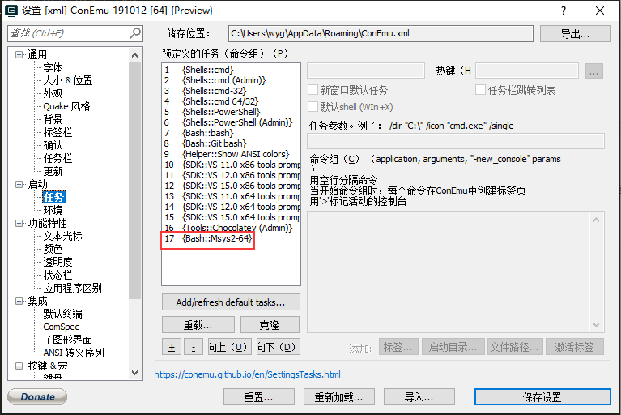
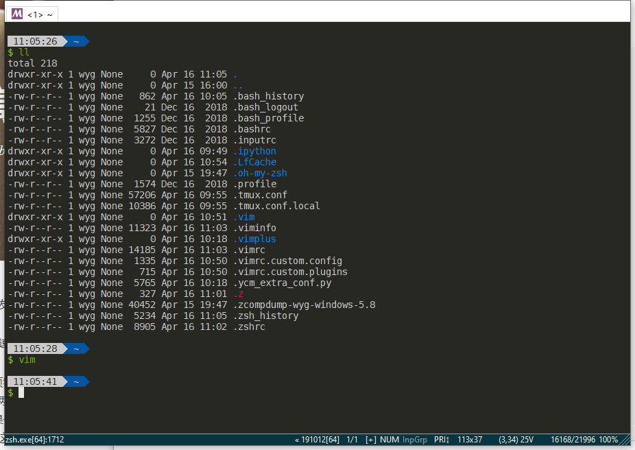

* any list
{:toc}

# Conemu+MSYS2安装配置

## 目录

{:toc}

## 前言

Windows环境下的终端实在是不太好用，后来发现了Conemu作为终端，使用方便多了（本来这篇文章要写cmder的，但是下载实在太慢，就换这个了QAQ）。再加上archlinux上的`pacman`来作为包管理器，整体体验会好不少。

不过更好的解决办法是vmware+linux虚拟机，当然过一段可以尝试下WSL2。

## Conemu的安装和配置

### 下载安装

[官方下载链接]( https://conemu.github.io/ )。安装的时候会默认安装在`C:/Program Files`或`C:/Program Files(x86)`（根据64位还是32位系统来选择）然后一路安装就行啦。

### 配置

简单配置几点

#### 语言


#### 字体

这里建议使用powerline字体，显示效果更好，没有的可以去[下载链接]( https://github.com/powerline/fonts )下载后安装。


#### 隐藏不必要控件（按自己喜好）


#### 注册到右键菜单


#### 设置cmd默认启动Conemu


#### 其它

还可以自行配置下主题、快捷键什么的。

## MSYS2安装与配置

### 下载安装

在[官网链接]( https://www.msys2.org/ )上下载安装就可以。默认安装路径`C:\msys64\`。

### 配置

首先在Conemu的`setting-Tasks`中刷新一下，应该就有`MSYS2`了。



#### 配置启动参数

默认参数为：

```sh
set CHERE_INVOKING=1 & set "PATH=%ConEmuDrive%\msys64\usr\bin;%PATH%" & %ConEmuBaseDirShort%\conemu-msys2-64.exe -new_console:p %ConEmuDrive%\msys64\usr\bin\bash.exe --login -i -new_console:C:"%ConEmuDrive%\msys64\msys2.ico"
```

我们修改几点：

1. 删除`set CHERE_INVOKING=1`，否则打开后的默认工作路径是` C:\users\administrator `。
2. 添加`set MSYS2_PATH_TYPE=inherit`合并`windows path`环境变量。

#### 设置为默认终端


还有：


现在从运行中执行`conemu64`或右键`Conemu Here`都是启动`MSYS2`啦。

#### Pacman包管理器配置

修改`/etc/pacman.conf`文件。把文件中的`Color`选项的注释取消掉。这样显示出的效果会好看点。

> 或者直接找到文件`C:\msys64\etc\pacman.conf`修改即可。

#### 换源

- 编辑`/etc/pacman.d/mirrorlist.mingw32`，在开头添加：

  ```txt
  Server = http://mirrors.ustc.edu.cn/msys2/mingw/i686
  ```

- 编辑`/etc/pacman.d/mirrorlist.mingw64`，在开头添加：

  ```txt
  Server = http://mirrors.ustc.edu.cn/msys2/mingw/x86_64
  ```

- 编辑`/etc/pacman.d/mirrorlist.msys`，在开关添加：

  ```txt
  Server = http://mirrors.ustc.edu.cn/msys2/msys/$arch
  ```

#### 安装zsh和oh-my-zsh

- 安装git和zsh

  ```bash
  pacman -S zsh git
  ```

- 安装oh-my-zsh

  ```bash
  sh -c "$(curl -fsSL https://raw.githubusercontent.com/robbyrussell/oh-my-zsh/master/tools/install.sh)"
  ```

- 更改默认终端（把`bash.exe`改成`zsh.exe`即可）

  

- 然后复制下主题和配置

  ```zsh
  git clone https://github.com/wyg1997/Linux-configs.git /tmp/Linux-configs
  # oh-my-zsh主题
  cp /tmp/Linux-configs/bullet-train.zsh-theme ~/.oh-my-zsh/themes/
  # 拷贝.zshrc
  cp /tmp/Linux-configs/.zshrc ~  # 然后在.zshrc中把ZSH路径改一下
  # zsh-autosuggestions
  git clone git://github.com/zsh-users/zsh-autosuggestions ~/.oh-my-zsh/plugins/zsh-autosuggestions
  # zsh-syntax-highlighting
  git clone https://github.com/zsh-users/zsh-syntax-highlighting.git ${ZSH_CUSTOM:-~/.oh-my-zsh/custom}/plugins/zsh-syntax-highlighting
  source .zshrc
  ```

#### ~~安装配置tmux~~

tmux的显示效果好像并不怎么好，这一步就不做了，后续如果有好的处理方法再补。

#### 安装vimplus

vimplus是我一直在用的一种vim配置，优点是安装方便、界面美观且好用。

```zsh
git clone https://github.com/wyg1997/vimplus.git ~/.vimplus
cd .vimplus
# copy
rm -rf ~/.vimrc
ln -s ${PWD}/.vimrc ~

rm -rf ~/.vimrc.custom.plugins
cp ${PWD}/.vimrc.custom.plugins ~

rm -rf ~/.vimrc.custom.config
cp ${PWD}/.vimrc.custom.config ~

rm -rf ~/.ycm_extra_conf.py
ln -s ${PWD}/.ycm_extra_conf.py ~

mkdir ~/.vim
rm -rf ~/.vim/colors
ln -s ${PWD}/colors ~/.vim

rm -rf ~/.vim/ftplugin
ln -s ${PWD}/ftplugin ~/.vim

rm -rf ~/.vim/autoload
ln -s ${PWD}/autoload ~/.vim
# 在.vimrc中删除YouCompleteMe插件
# install plugin
vim -c "PlugInstall" -c "q" -c "q"
```

## 效果



